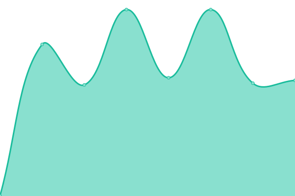

# [📈 Live Status](https://status.streampanel.net): <!--live status--> **🟩 All systems operational**

This repository contains the open-source uptime monitor and status page for [STREAMPANEL](https://www.streampanel.net/), powered by [Upptime](https://github.com/upptime/upptime).

With [Upptime](https://upptime.js.org), you can get your own unlimited and free uptime monitor and status page, powered entirely by a GitHub repository. We use [Issues](https://github.com/streampanel/status.streampanel.net/issues) as incident reports, [Actions](https://github.com/streampanel/status.streampanel.net/actions) as uptime monitors, and [Pages](https://status.streampanel.net) for the status page.

<!--start: status pages-->
<!-- This summary is generated by Upptime (https://github.com/upptime/upptime) -->
<!-- Do not edit this manually, your changes will be overwritten -->
<!-- prettier-ignore -->
| URL | Status | History | Response Time | Uptime |
| --- | ------ | ------- | ------------- | ------ |
|  [Webseite / www.streampanel.net](https://www.streampanel.net) | 🟩 Up | [webseite-www-streampanel-net.yml](https://github.com/STREAMPANEL/status.streampanel.net/commits/HEAD/history/webseite-www-streampanel-net.yml) | 

 279ms
     
 | 

<a href="https://status.streampanel.net/history/webseite-www-streampanel-net">100.00%</a>
    

|  [Webseite / www.spcast.eu](https://www.spcast.eu) | 🟩 Up | [webseite-www-spcast-eu.yml](https://github.com/STREAMPANEL/status.streampanel.net/commits/HEAD/history/webseite-www-spcast-eu.yml) | 

 210ms
     
 | 

<a href="https://status.streampanel.net/history/webseite-www-spcast-eu">100.00%</a>
    

|  [Webseite / www.spradio.eu](https://www.spradio.eu) | 🟩 Up | [webseite-www-spradio-eu.yml](https://github.com/STREAMPANEL/status.streampanel.net/commits/HEAD/history/webseite-www-spradio-eu.yml) | 

 899ms
     
 | 

<a href="https://status.streampanel.net/history/webseite-www-spradio-eu">100.00%</a>
    

|  [Webseite / www.webradiotop100.de](https://www.webradiotop100.de) | 🟩 Up | [webseite-www-webradiotop100-de.yml](https://github.com/STREAMPANEL/status.streampanel.net/commits/HEAD/history/webseite-www-webradiotop100-de.yml) | 

 2405ms
     
 | 

<a href="https://status.streampanel.net/history/webseite-www-webradiotop100-de">100.00%</a>
    

|  [Webseite / www.shoutcast-tools.de](https://www.shoutcast-tools.de) | 🟩 Up | [webseite-www-shoutcast-tools-de.yml](https://github.com/STREAMPANEL/status.streampanel.net/commits/HEAD/history/webseite-www-shoutcast-tools-de.yml) | 

 1861ms
     
 | 

<a href="https://status.streampanel.net/history/webseite-www-shoutcast-tools-de">100.00%</a>
    

|  [Webseite / www.shoutcast-tools.com](https://www.shoutcast-tools.com) | 🟩 Up | [webseite-www-shoutcast-tools-com.yml](https://github.com/STREAMPANEL/status.streampanel.net/commits/HEAD/history/webseite-www-shoutcast-tools-com.yml) | 

 2111ms
     
 | 

<a href="https://status.streampanel.net/history/webseite-www-shoutcast-tools-com">100.00%</a>
    

|  [Kundencenter / login.streampanel.net](https://login.streampanel.net) | 🟩 Up | [kundencenter-login-streampanel-net.yml](https://github.com/STREAMPANEL/status.streampanel.net/commits/HEAD/history/kundencenter-login-streampanel-net.yml) | 

 1255ms
     
 | 

<a href="https://status.streampanel.net/history/kundencenter-login-streampanel-net">100.00%</a>
    

|  Webhosting | 🟩 Up | [webhosting.yml](https://github.com/STREAMPANEL/status.streampanel.net/commits/HEAD/history/webhosting.yml) | 

 436ms
     
 | 

<a href="https://status.streampanel.net/history/webhosting">100.00%</a>
    

|  Centova Cast / Dedicated | 🟩 Up | [centova-cast-dedicated.yml](https://github.com/STREAMPANEL/status.streampanel.net/commits/HEAD/history/centova-cast-dedicated.yml) | 

 663ms
     
 | 

<a href="https://status.streampanel.net/history/centova-cast-dedicated">100.00%</a>
    

|  Centova Cast / Cloud | 🟩 Up | [centova-cast-cloud.yml](https://github.com/STREAMPANEL/status.streampanel.net/commits/HEAD/history/centova-cast-cloud.yml) | 

 685ms
     
 | 

<a href="https://status.streampanel.net/history/centova-cast-cloud">100.00%</a>
    

|  Teamspeak 3 | 🟩 Up | [teamspeak-3.yml](https://github.com/STREAMPANEL/status.streampanel.net/commits/HEAD/history/teamspeak-3.yml) | 

 498ms
     
 | 

<a href="https://status.streampanel.net/history/teamspeak-3">100.00%</a>
    

|  Safeguard / Webradio & Webhosting | 🟩 Up | [safeguard-webradio-and-webhosting.yml](https://github.com/STREAMPANEL/status.streampanel.net/commits/HEAD/history/safeguard-webradio-and-webhosting.yml) | 

 627ms
     
 | 

<a href="https://status.streampanel.net/history/safeguard-webradio-and-webhosting">100.00%</a>
    

|  Monitoring / Frankfurt | 🟩 Up | [monitoring-frankfurt.yml](https://github.com/STREAMPANEL/status.streampanel.net/commits/HEAD/history/monitoring-frankfurt.yml) | 

 432ms
     
 | 

<a href="https://status.streampanel.net/history/monitoring-frankfurt">100.00%</a>
    

|  Monitoring / Warschau | 🟩 Up | [monitoring-warschau.yml](https://github.com/STREAMPANEL/status.streampanel.net/commits/HEAD/history/monitoring-warschau.yml) | 

 476ms
     
 | 

<a href="https://status.streampanel.net/history/monitoring-warschau">100.00%</a>
    

|  Monitoring / London | 🟩 Up | [monitoring-london.yml](https://github.com/STREAMPANEL/status.streampanel.net/commits/HEAD/history/monitoring-london.yml) | 

 394ms
     
 | 

<a href="https://status.streampanel.net/history/monitoring-london">100.00%</a>
    

|  Monitoring / Stra륵urg | 🟩 Up | [monitoring-strassburg.yml](https://github.com/STREAMPANEL/status.streampanel.net/commits/HEAD/history/monitoring-strassburg.yml) | 

 417ms
     
 | 

<a href="https://status.streampanel.net/history/monitoring-strassburg">100.00%</a>
    

|  [SPCast / Loadbalancer](https://loadbalancer.sp.radio.fm/) | 🟩 Up | [sp-cast-loadbalancer.yml](https://github.com/STREAMPANEL/status.streampanel.net/commits/HEAD/history/sp-cast-loadbalancer.yml) | 

 483ms
     
 | 

<a href="https://status.streampanel.net/history/sp-cast-loadbalancer">100.00%</a>
    

<!--end: status pages-->

[**Visit our status website →**](https://status.streampanel.net)

## 📄 License

- Powered by: [Upptime](https://github.com/upptime/upptime)
- Code: [MIT](./LICENSE) © [STREAMPANEL](https://www.streampanel.net/)
- Data in the `./history` directory: [Open Database License](https://opendatacommons.org/licenses/odbl/1-0/)
